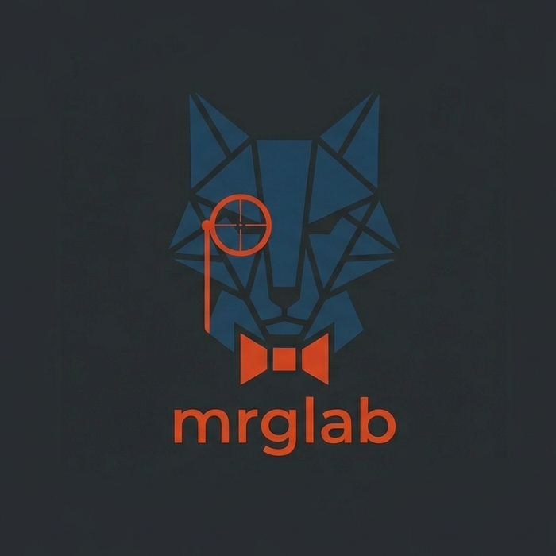

# MR.G.Lab (mrglab)



[](https://github.com/felipeospina21/mrglab)
[](https://github.com/felipeospina21/mrglab/blob/main/LICENSE)
[](https://github.com/felipeospina21/mrglab/releases)
[](https://goreportcard.com/report/github.com/felipeospina21/mrglab)
[](https://github.com/felipeospina21/mrglab)

mrglab is a TUI to manage `merge requests` in Gitlab from the command line.


## Requirements

- Nerd Font (Symbols) v3.2.1 or higher [ download ](https://github.com/ryanoasis/nerd-fonts/releases/download/v3.2.1/NerdFontsSymbolsOnly.zip)

## Install

```bash
go install github.com/felipeospina21/mrglab@latest
```

### From source

```bash
git clone https://github.com/felipeospina21/mrglab.git
cd mrglab
make build
```

This creates the `mrglab` binary in the project directory. To make it available system-wide:

```bash
sudo mv mrglab /usr/local/bin/
```

## Usage

Launch the TUI:

```bash
mrglab
```

### Dev mode

Run with mocked data (no API calls):

```bash
mrglab -dev
```

## Features

- Browse open merge requests for your configured GitLab projects
- View MR details: description, pipeline stages, approvals, branches, and discussions
- Merge a merge request directly from the TUI
- Open any MR in your browser
- Respond to discussion threads (post comments)
- Open new MR (including default templates)
- Navigate between resolvable discussions
- Browse pipelines with status, commit, jobs count, author, branch, and duration
- View pipeline details with stages and jobs breakdown
- Navigate and run individual jobs (play manual, retry failed/canceled/skipped)
- Cancel running pipelines and jobs
- Retry all failed jobs in a pipeline
- Tab navigation between Merge Requests and Pipelines views
- Copy modal content to clipboard
- Toggle project list and details panels
- Full-screen help modal with all keybindings

## Keybindings

### Global

| Key      | Action                  |
| -------- | ----------------------- |
| `?`      | Toggle help             |
| `ctrl+c` | Quit                    |
| `ctrl+o` | Toggle side panel       |
| `@`      | Open full message modal |

### Projects panel

| Key     | Action              |
| ------- | ------------------- |
| `enter` | View merge requests |

### Merge requests panel

| Key     | Action          |
| ------- | --------------- |
| `enter` | View details    |
| `tab`   | Switch to Pipelines tab |
| `x`     | Open in browser |
| `M`     | Merge MR        |
| `N`     | New MR          |
| `R`     | Refresh list    |
| `↑/k`   | Move up         |
| `↓/j`   | Move down       |

### Pipelines panel

| Key     | Action              |
| ------- | ------------------- |
| `enter` | View details        |
| `tab`   | Switch to MR tab    |
| `x`     | Open in browser     |
| `r`     | Retry failed jobs   |
| `C`     | Cancel pipeline     |
| `↑/k`   | Move up             |
| `↓/j`   | Move down           |

### MR Details panel

| Key   | Action                |
| ----- | --------------------- |
| `esc` | Close panel           |
| `x`   | Open in browser       |
| `M`   | Merge MR              |
| `C`   | Respond to discussion |
| `n`   | Next discussion       |
| `N`   | Previous discussion   |
| `f`   | Toggle fullscreen     |

### Pipeline Details panel

| Key   | Action            |
| ----- | ----------------- |
| `esc` | Close panel       |
| `x`   | Open in browser   |
| `n`   | Next job          |
| `N`   | Previous job      |
| `P`   | Run job           |
| `X`   | Cancel job        |
| `f`   | Toggle fullscreen |

### Modal

| Key      | Action            |
| -------- | ----------------- |
| `esc`    | Close modal       |
| `ctrl+s` | Submit            |
| `ctrl+y` | Copy to clipboard |

## Config

Config file is read from `~/.config/mrglab/mrglab.toml` by default.

**To access private repos, you will need to set an env variable with a [gitlab personal access token](https://docs.gitlab.com/ee/user/profile/personal_access_tokens.html). This can be set in your shell config file (to persist it) or in your terminal (for the session).**

```bash
export MRGLAB_TOKEN="YOUR_GITLAB_TOKEN"
```

### Config properties

| Option             | Description             | Default              | Required |
| ------------------ | ----------------------- | -------------------- | -------- |
| `base_url`         | Base GitLab URL         | `https://gitlab.com` | No       |
| `filters.projects` | List of project objects | —                    | Yes      |

### Project object

Each project in `filters.projects` has the following fields:

| Field      | Type     | Description                                                        |
| ---------- | -------- | ------------------------------------------------------------------ |
| `name`     | `string` | Display name shown in the project list                             |
| `id`       | `string` | GitLab project ID used to fetch merge requests                     |
| `fullPath` | `string` | URL path to the project after the base URL (e.g. `gitlab-org/cli`) |

### Config example

```toml
base_url = "https://gitlab.com"

[filters]
projects = [
	{ name = "Gitlab Cli", id = "34675721", fullPath = "gitlab-org/cli" },
	{ name = "My Project", id = "12345678", fullPath = "my-group/my-project" },
]
```

## Contributing

See [CONTRIBUTING.md](CONTRIBUTING.md) for guidelines on how to contribute.

## License

This project is licensed under the [MIT License](LICENSE).

## Disclaimer

The purpose of this project was to learn more about `go` and `bubbletea`. It is by no means a full replacement of Gitlab UI (and it is not planned to be), but a complementary tool that would fit in some terminal workflows.

## Inspiration

This project is inspired by tools like [gh-dash](https://github.com/dlvhdr/gh-dash).
